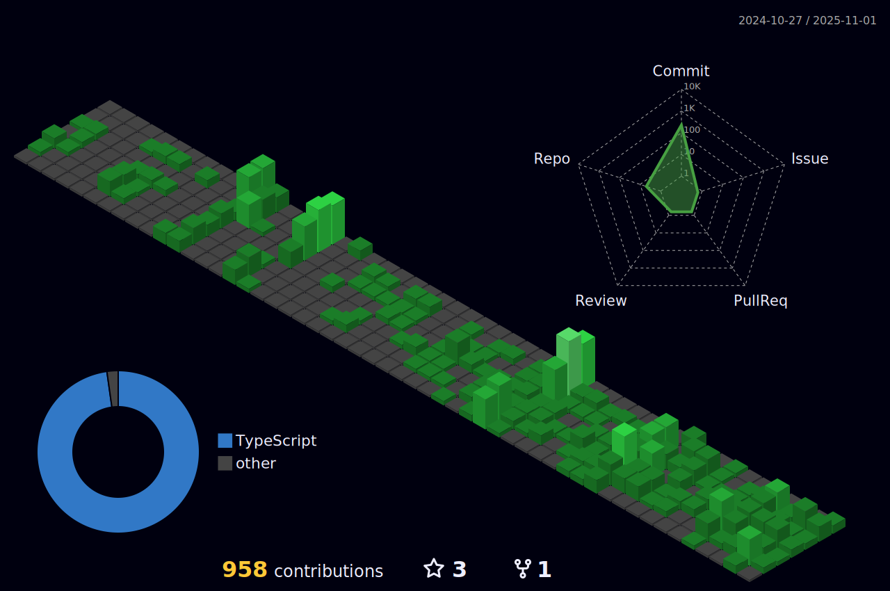

 

## About Me

- Exploring new technologies and developing software solutions.
- Working as a Full Stack Developer at [Apex NFT Brasil](https://www.apexstudio.io/).
- Learning more about Web3 and Front-end technologies.
- Since 2022, I have been creating high-quality Front-end and Web3 solutions.

## Activity

  | |   |  
 | ----------- | ----------- |

 

## My Skills

- Proficient in Node.js, React.js, and Next.js with a strong command of TypeScript.

## Languages and Tools

## Find me

